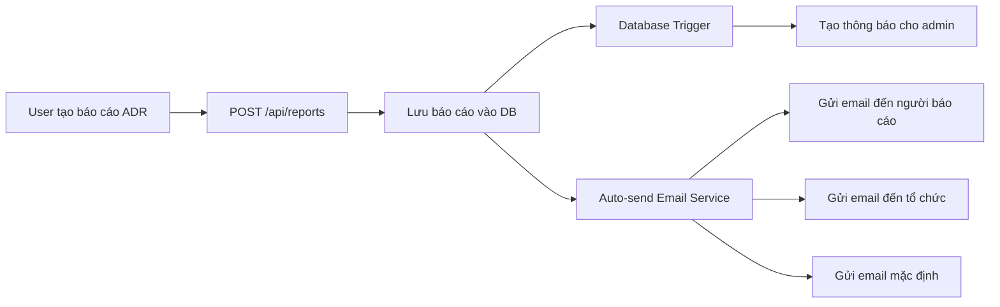

# 📧 Hướng dẫn Tự động gửi Email Thông báo cho Báo cáo ADR

## 🎯 Tổng quan

Hệ thống **tự động gửi email thông báo** khi có báo cáo ADR mới được tạo. Email sẽ được gửi đến:

1. ✅ **Người báo cáo** - Email cá nhân (nếu có `reporter_email`)
2. ✅ **Tổ chức báo cáo** - Email của đơn vị y tế
3. ✅ **Email mặc định** - Di.pvcenter@gmail.com

---

## 🚀 Cách hoạt động

### **Quy trình tự động:**



### **1. Khi báo cáo được tạo:**

- API endpoint `POST /api/reports` hoặc `POST /api/public/reports`
- Sau khi lưu báo cáo thành công
- **Tự động gọi** `sendAutoReportEmail()`

### **2. Email được gửi đến:**

```typescript
// Ưu tiên gửi:
1. reporter_email (nếu có) → Email người báo cáo
2. organization_email → Email tổ chức (map từ organization name)
3. default_email → di.pvcenter@gmail.com
```

### **3. Nội dung email:**

- ✅ **Subject:** `[ADR] 2024-000123 - Nguyễn Văn A (Nghiêm trọng)`
- ✅ **HTML Template:** Email đẹp, responsive với đầy đủ thông tin
- ✅ **Sections:** A, B, C, D, E theo mẫu báo cáo ADR
- ✅ **Color-coded severity badges**

---

## ⚙️ Cấu hình

### **1. Organization Email Mapping**

Chỉnh sửa file: `lib/auto-email-service.ts`

```typescript
const ORGANIZATION_EMAILS: Record<string, string> = {
  // Format: "Tên tổ chức": "email@domain.com"
  'Sở Y tế Thành phố': process.env.SOYTE_EMAIL || 'di.pvcenter@gmail.com',
  'Bệnh viện Đa khoa ABC': 'benhvien.abc@gmail.com',
  'Bệnh viện Đại học Y': 'bvdaihoc@gmail.com',
  'Bệnh viện Trung ương': 'bvtrunguong@gmail.com',
  
  // Default email nếu không tìm thấy organization
  'default': process.env.DEFAULT_NOTIFICATION_EMAIL || 'di.pvcenter@gmail.com'
}
```

### **2. Environment Variables**

Thêm vào `.env.local`:

```bash
# Email Configuration - Auto Notification
SOYTE_EMAIL=di.pvcenter@gmail.com
DEFAULT_NOTIFICATION_EMAIL=di.pvcenter@gmail.com

# SMTP Settings (for production)
EMAIL_FROM=noreply@adrsystem.gov.vn
SMTP_HOST=smtp.gmail.com
SMTP_PORT=587
SMTP_SECURE=false
SMTP_USER=your-email@gmail.com
SMTP_PASS=your-app-password
```

### **3. Gmail SMTP Setup (Production)**

**Để gửi email thật với Gmail:**

1. **Bật 2-Step Verification** cho Gmail account
2. **Tạo App Password:**
   - Truy cập: https://myaccount.google.com/apppasswords
   - Chọn "Mail" và "Other (Custom name)"
   - Nhập tên: "ADR System"
   - Copy password (16 ký tự)
3. **Cập nhật .env.local:**
   ```bash
   SMTP_HOST=smtp.gmail.com
   SMTP_PORT=587
   SMTP_USER=your-email@gmail.com
   SMTP_PASS=xxxx xxxx xxxx xxxx # App password
   ```

---

## 🧪 Testing

### **Test 1: Development Mode (Ethereal Email)**

Không cần SMTP thật, test ngay:

```bash
# 1. Start server
npm run dev

# 2. Tạo báo cáo ADR mới (qua UI hoặc API)
# 3. Check console logs:
📧 Auto email sent successfully for report 2024-000123:
  sentTo: ['reporter@email.com', 'di.pvcenter@gmail.com']

# 4. Copy link preview từ console và mở trong browser
https://ethereal.email/message/xxxxx
```

### **Test 2: API Endpoint**

```bash
# Test auto-send email cho báo cáo cụ thể
curl -X POST http://localhost:3000/api/reports/auto-email \
  -H "Content-Type: application/json" \
  -d '{
    "reportId": "uuid-of-report",
    "includeReporter": true,
    "includeOrganization": true
  }'

# Response:
{
  "success": true,
  "message": "Email tự động đã được gửi thành công",
  "reportCode": "2024-000123",
  "sentTo": [
    "reporter@email.com",
    "di.pvcenter@gmail.com"
  ]
}
```

### **Test 3: Check Email Status**

```bash
# Kiểm tra config email cho báo cáo
curl http://localhost:3000/api/reports/auto-email?reportId=uuid-here

# Response:
{
  "success": true,
  "reportCode": "2024-000123",
  "autoEmailEnabled": true,
  "configuration": {
    "hasReporterEmail": true,
    "hasOrganizationEmail": true,
    "organization": "Bệnh viện ABC",
    "reporterEmail": "doctor@hospital.vn"
  }
}
```

---

## 📊 API Endpoints

### **POST /api/reports/auto-email**

Gửi email tự động cho báo cáo đã tạo.

**Request:**
```json
{
  "reportId": "uuid-of-report",
  "includeReporter": true,
  "includeOrganization": true,
  "additionalRecipients": ["extra@email.com"]
}
```

**Response:**
```json
{
  "success": true,
  "message": "Email tự động đã được gửi thành công",
  "reportCode": "2024-000123",
  "sentTo": ["reporter@email.com", "di.pvcenter@gmail.com"],
  "failures": []
}
```

### **GET /api/reports/auto-email?reportId=xxx**

Kiểm tra cấu hình email cho báo cáo.

---

## 🔍 Logs và Monitoring

### **Console Logs:**

```bash
# Success
📧 Auto email sent successfully for report 2024-000123:
  sentTo: ['reporter@email.com', 'di.pvcenter@gmail.com']

# Warning (một số email failed)
⚠️ Auto email failed for report 2024-000123:
  failures: [
    { email: 'invalid@email', error: 'Invalid email format' }
  ]

# Error
❌ Auto email error for report 2024-000123: Error message here
```

### **Xem email preview (Development):**

- Server tự động log preview URL
- Mở trong browser để xem email
- Không cần SMTP thật

---

## 🎨 Customization

### **1. Thay đổi email template:**

Edit: `lib/email-templates/adr-report.ts`

```typescript
export function generateADRReportEmailHTML(report: ADRReport): string {
  // Customize HTML template here
  return `<!DOCTYPE html>...`
}
```

### **2. Thêm organization mới:**

Edit: `lib/auto-email-service.ts`

```typescript
const ORGANIZATION_EMAILS: Record<string, string> = {
  'Bệnh viện XYZ': 'benhvien.xyz@gmail.com', // ← Thêm dòng này
  // ...
}
```

### **3. Custom email logic:**

```typescript
// Trong sendAutoReportEmail(), customize recipients:
export async function sendAutoReportEmail(
  report: ADRReport,
  options?: {
    includeReporter?: boolean
    includeOrganization?: boolean
    additionalRecipients?: string[]
  }
) {
  // Custom logic here
}
```

---

## ⚠️ Lưu ý quan trọng

### **1. Email sending không làm fail request:**

- Nếu email failed → Báo cáo vẫn được lưu thành công
- Error được log nhưng không return error cho user
- User vẫn thấy "Báo cáo đã được tạo thành công"

### **2. Asynchronous sending:**

```typescript
// Email được gửi bất đồng bộ, không chờ kết quả
sendAutoReportEmail(report).then(result => {
  console.log('Email sent:', result)
}).catch(err => {
  console.error('Email error:', err)
})

// Request return ngay lập tức
return NextResponse.json({ success: true })
```

### **3. Rate limiting:**

- Gmail SMTP: ~500 emails/day (free)
- Nếu vượt quá → Consider SendGrid, AWS SES, Mailgun
- Implement queue system cho volume cao

### **4. Email validation:**

```typescript
import { isValidEmail } from '@/lib/email-service'

if (isValidEmail(email)) {
  // Send email
}
```

---

## 🛠️ Troubleshooting

### **Problem: Email không được gửi**

**Giải pháp:**
1. Check console logs
2. Verify SMTP credentials
3. Test với Ethereal Email (development)
4. Check internet connection

### **Problem: Email vào spam**

**Giải pháp:**
1. Sử dụng domain email chuyên nghiệp (không dùng Gmail)
2. Cấu hình SPF, DKIM, DMARC records
3. Warm-up email reputation
4. Sử dụng email service chuyên nghiệp (SendGrid, AWS SES)

### **Problem: Organization không có email**

**Giải pháp:**
- Email sẽ được gửi đến `default` email
- Thêm organization vào `ORGANIZATION_EMAILS` mapping

### **Problem: Reporter không có email**

**Giải pháp:**
- Email chỉ gửi đến organization email
- Không fail request

---

## 📚 Related Documentation

- [Email Setup Guide](./email-setup-guide.md)
- [Email Templates](../lib/email-templates/adr-report.ts)
- [API Documentation](./API.md)

---

## ✨ Features Summary

| Feature | Status | Description |
|---------|--------|-------------|
| Auto-send on report creation | ✅ | Tự động gửi khi tạo báo cáo |
| Reporter email | ✅ | Gửi đến email người báo cáo |
| Organization email | ✅ | Gửi đến email tổ chức |
| Default email | ✅ | Gửi đến email mặc định |
| Beautiful HTML template | ✅ | Email template đẹp, responsive |
| Development testing | ✅ | Test với Ethereal Email |
| Production SMTP | ✅ | Hỗ trợ Gmail SMTP |
| Error handling | ✅ | Graceful failure, không làm crash |
| Async sending | ✅ | Không block request |
| Custom recipients | ✅ | Thêm email bổ sung |
| Email validation | ✅ | Validate format |
| Logging | ✅ | Console logs đầy đủ |

---

**🎉 Chức năng hoàn chỉnh và sẵn sàng sử dụng!**


